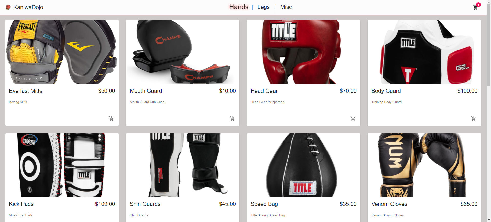

# KaniwaDojo
This e-commerce project is named after my first martial arts studio that molded my discipline as a young adult, and preparred me to take on any and all challenges head on.
This project allows for the user to select from a wide range of required gear when attending a martial arts school, and has a complete mock checkout process. (Be sure to put in 4242424242424242 for the card/exp/zipcode information)
## Technologies Used | How to run
Made utilizing the following technologies:
 * **React.js**
 * **Redux.js** 
 * **HTML5**
 * **CSS3**
 * **JavaScript**

How to run this app:
* Clone this repo to your machine
* Open your favorite text editor and a terminal
* Run the following commands: 
* $ cd e_commerce 
* $ npm install 
* $ cd src  
* $ npm start //Runs the app in http://localhost:3000
### Developer Notes

Working on this project helped me grow as a junior developer. Utilizing the various libraries for styling and commerce.js for storing data proved a great experience driven project for growth. (I'm constantly making style changes as I learn better approaches).
Currently the categories selectors at the top need some adjustments to work properly, though their hover states should still be visible.
